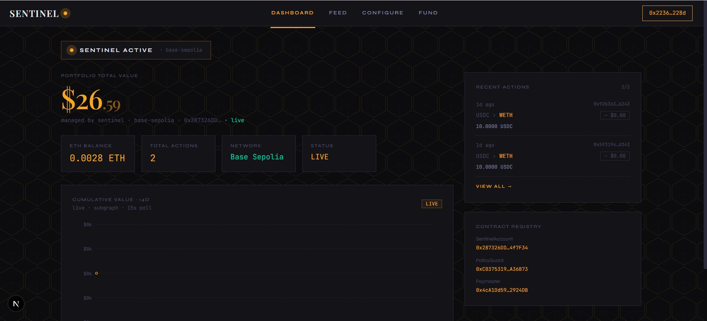
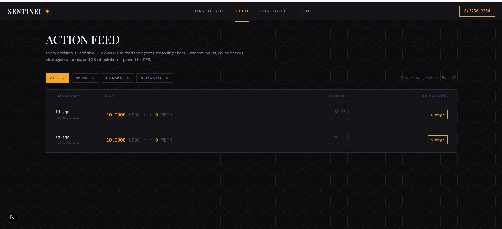
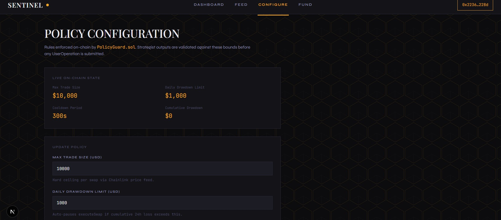
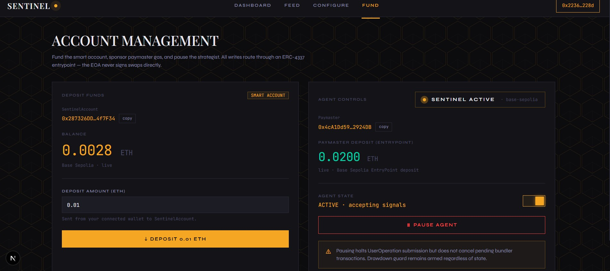

# Sentinel — Verifiable AI Portfolio Agent

An autonomous AI agent that manages an on-chain portfolio through an ERC-4337 smart account, constrained by on-chain policy guard contracts. Every trade decision's reasoning is pinned to IPFS and auditable from a dashboard.

**Stack:** Python · LangGraph · Solidity · ERC-4337 · The Graph · Next.js · Base Sepolia

---

## Screenshots

### Dashboard


### Action Feed


### Configure Policy


### Fund Account


---

## Architecture

```
┌─────────────────────────────────────────────────────────┐
│                     FRONTEND (Next.js)                   │
│  Connect → Fund → Configure Policy → Watch Feed → Why?  │
└────────────────────────┬────────────────────────────────┘
                         │ wagmi / viem / Apollo
┌────────────────────────▼────────────────────────────────┐
│                   AGENT LAYER (Python)                   │
│  LangGraph: Researcher → Strategist → Risk → Executor   │
│                        ↓                                │
│              IPFS (Pinata) — reasoning JSON             │
└────────────────────────┬────────────────────────────────┘
                         │ ERC-4337 UserOperation
┌────────────────────────▼────────────────────────────────┐
│              EXECUTION INFRA                             │
│  Pimlico bundler → Paymaster (gasless) → EntryPoint     │
└────────────────────────┬────────────────────────────────┘
                         │ on-chain
┌────────────────────────▼────────────────────────────────┐
│                   CONTRACT LAYER (Solidity)              │
│  SentinelAccount (ERC-4337) + PolicyGuard + ActionLog   │
└────────────────────────┬────────────────────────────────┘
                         │ events
┌────────────────────────▼────────────────────────────────┐
│               INDEXER (The Graph)                        │
│  ActionLog.ActionExecuted → Action + DailyPnL entities  │
└─────────────────────────────────────────────────────────┘
```

---

## Key Data Flow

1. Agent builds an ERC-4337 `UserOperation` with `SentinelAccount.execute()` calldata
2. Reasoning JSON is pinned to IPFS (Pinata) — CID injected into calldata
3. UserOperation submitted to Pimlico bundler; `SentinelPaymaster` sponsors gas
4. On-chain: `PolicyGuard.checkPolicy()` enforces rules, then DEX swap executes, `ActionLog` emits event with IPFS CID
5. The Graph indexes the event; frontend polls via Apollo every 15s
6. "Why?" button fetches the IPFS blob and renders the full reasoning chain

---

## Deployed Contracts (Base Sepolia)

| Contract | Address |
|----------|---------|
| SentinelAccount | `0x287326DDFf84973f9D23e6495cc9d727F14f7F34` |
| PolicyGuard | `0xC0375319E7623041875ee485D84A652Da2A36B73` |
| ActionLog | `0x0868A14343fA9A5F12ACdCc716e9f072ec0C0bb4` |
| SentinelPaymaster | `0x4cA1Dd59F9d690bd1Fa4739AC157A2Bea12924DB` |

---

## Running Locally

### Frontend
```bash
cd frontend
npm install
npm run dev       # http://localhost:3000
```

### Agent (one cycle)
```bash
cd agent
uv venv .venv && source .venv/bin/activate
uv pip install -r requirements.txt
python -m agent.main
```

### Agent (loop every 15 min)
```bash
python -m agent.main --loop
```

---

## Environment Variables

### Agent (`agent/.env`)
```
PRIVATE_KEY=
BASE_SEPOLIA_RPC=
PIMLICO_API_KEY=
PINATA_JWT=
OPENAI_API_KEY=
ONEINCH_API_KEY=
SUPABASE_URL=
SUPABASE_KEY=
```

### Frontend (`frontend/.env.local`)
```
NEXT_PUBLIC_SUBGRAPH_URL=
NEXT_PUBLIC_SENTINEL_ACCOUNT=
NEXT_PUBLIC_POLICY_GUARD=
NEXT_PUBLIC_ACTION_LOG=
NEXT_PUBLIC_PAYMASTER=
```

---

## Academic Context

Per the agent-blockchain standards survey (arxiv:2601.04583), Sentinel operates at **Execution Level 4 — Autonomous Signing**: the agent independently signs and submits UserOperations without human approval per transaction, constrained only by on-chain policy contracts.
