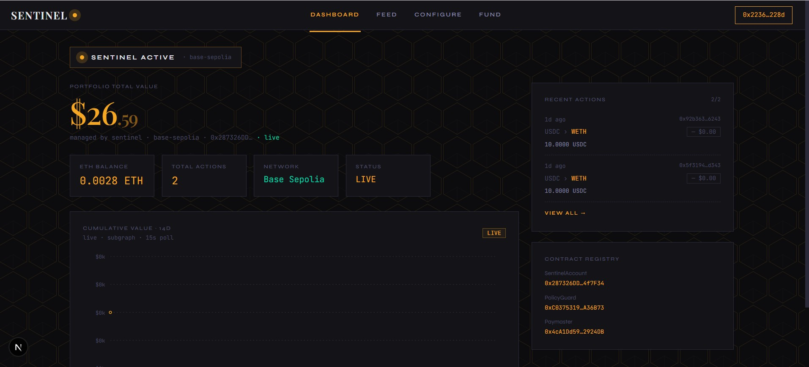
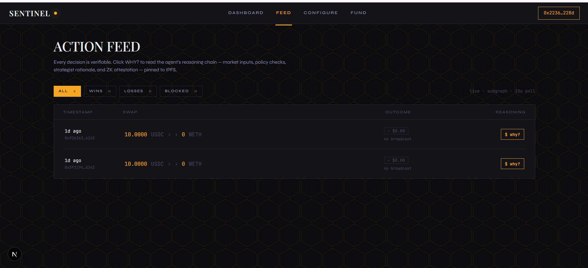
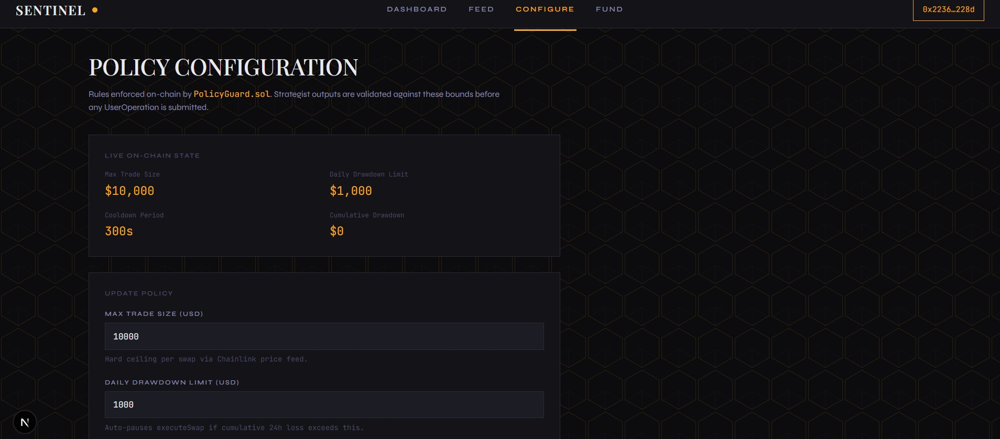
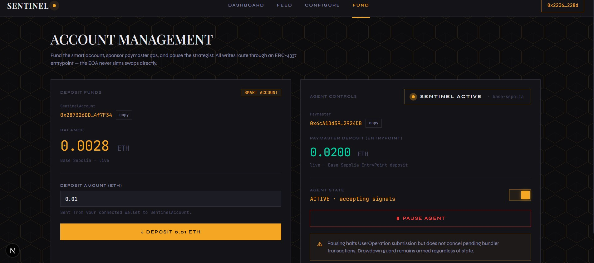

# Sentinel — Verifiable AI Portfolio Agent

An autonomous AI agent that manages a crypto portfolio on Base Sepolia via an ERC-4337 smart account, constrained by on-chain policy guard contracts. Every trade decision is pinned to IPFS and auditable from a live dashboard.

## What It Does

The agent runs a LangGraph pipeline every 15 minutes:
1. **Researcher** — fetches live prices, holdings, and market sentiment
2. **Strategist** — proposes a swap using GPT-4o and 1inch quotes
3. **Risk Check** — reads the live `PolicyGuard` parameters on-chain, then asks `gpt-4o-mini` to judge pass/fail (an LLM pre-check, not a deterministic evaluation); the binding gate is `PolicyGuard.checkPolicy()` reverting on-chain
4. **Executor** — builds an ERC-4337 UserOperation, pins reasoning to IPFS, broadcasts via Pimlico (gas is paid from the smart account's own deposit — no paymaster is attached)
5. **Auditor** — saves the full action record to Supabase

Every on-chain action emits an event indexed by The Graph subgraph. The frontend reads it via Apollo and lets you click **WHY?** on any trade to see the full reasoning chain — market context, policy decision, strategist rationale, and a ZK-attestation slot (currently a placeholder; see [Implementation Status](#implementation-status)).

## Screenshots

| Dashboard | Action Feed |
|-----------|-------------|
|  |  |

| Configure Policy | Fund Account |
|-----------------|-------------|
|  |  |

## Architecture

```
┌─────────────────────────────────────────────────────────┐
│                     FRONTEND (Next.js)                   │
│  Connect → Fund → Configure Policy → Watch Feed → Why?  │
└────────────────────────┬────────────────────────────────┘
                         │ wagmi / viem / Apollo
┌────────────────────────▼────────────────────────────────┐
│                   AGENT LAYER (Python)                   │
│  LangGraph: Researcher → Strategist → Risk → Executor   │
│                        ↓                                │
│              IPFS (Pinata) — reasoning JSON             │
└────────────────────────┬────────────────────────────────┘
                         │ ERC-4337 UserOperation
┌────────────────────────▼────────────────────────────────┐
│              EXECUTION INFRA                             │
│  Pimlico bundler → EntryPoint (account pays gas; the    │
│  deployed SentinelPaymaster is not attached to UserOps) │
└────────────────────────┬────────────────────────────────┘
                         │ on-chain
┌────────────────────────▼────────────────────────────────┐
│                   CONTRACT LAYER (Solidity)              │
│  SentinelAccount (ERC-4337) + PolicyGuard + ActionLog   │
└────────────────────────┬────────────────────────────────┘
                         │ events
┌────────────────────────▼────────────────────────────────┐
│               INDEXER (The Graph)                        │
│  ActionLog.ActionExecuted → Action + DailyPnL entities  │
└─────────────────────────────────────────────────────────┘
```

---

## Key Data Flow

1. Agent builds an ERC-4337 v0.7 `UserOperation` with `SentinelAccount.executeSwap()` calldata
2. Reasoning JSON is pinned to IPFS (Pinata) — CID injected into calldata
3. UserOperation submitted to Pimlico bundler. Gas is paid from the SentinelAccount's own EntryPoint deposit: `SentinelPaymaster` is deployed, registered and pre-funded by `contracts/script/Deploy.s.sol`, but `agent/nodes/executor.py` leaves every `paymaster*` field `None` (and `agent/tools/userop.py` therefore hashes an empty `paymasterAndData`), so operations are **not** sponsored yet
4. On-chain: `PolicyGuard.checkPolicy()` enforces rules, then the swap call goes to `MockDex.sol` — a testnet stand-in whose fallback accepts any calldata and emits a fake fill (no Uniswap pool is touched) — and `ActionLog` emits the event with the IPFS CID
5. The Graph indexes the event; frontend polls via Apollo every 15s
6. "Why?" button fetches the IPFS blob and renders the full reasoning chain

---

## Deployed Contracts (Base Sepolia)

| Contract | Address |
|----------|---------|
| SentinelAccount | `0x287326DDFf84973f9D23e6495cc9d727F14f7F34` |
| PolicyGuard | `0xC0375319E7623041875ee485D84A652Da2A36B73` |
| ActionLog | `0x0868A14343fA9A5F12ACdCc716e9f072ec0C0bb4` |
| SentinelPaymaster | `0x4cA1Dd59F9d690bd1Fa4739AC157A2Bea12924DB` (deployed and funded; not attached to UserOps) |
| MockDex | `0x992e95FaDe5959a51a120b4e490653CC2198a936` (hard-coded as `UNISWAP_V3_ROUTER` in `agent/tools/uniswap.py`; not in `deployments/base-sepolia.json`) |

`PolicyVerifier.sol` is not deployed and is not referenced by `Deploy.s.sol`.

---

## Running Locally

### Frontend
```bash
cd frontend
npm install
npm run dev       # http://localhost:3000
```

### Agent (one cycle)
Run from the **repository root** so the `agent` package is importable (this is what
`.github/workflows/agent.yml` and `nixpacks.toml` do):
```bash
uv venv .venv && source .venv/bin/activate
uv pip install -r agent/requirements.txt
cp agent/.env.example agent/.env   # fill in your keys
python -m agent.main           # single cycle
python -m agent.main --loop    # 15-min cron
```

### 3. Frontend

```bash
cd frontend
npm install
cp .env.example .env.local     # fill in subgraph URL and contract addresses
npm run dev
```

Open http://localhost:3000

### 4. Subgraph

```bash
cd subgraph
npm install
graph auth <deploy-key>
graph codegen && graph build
graph deploy sentinel
```

## Environment Variables

### Agent (`agent/.env`)

| Variable | Purpose |
|---|---|
| `PRIVATE_KEY` | Agent signing wallet private key |
| `BASE_SEPOLIA_RPC` | RPC endpoint (default: https://sepolia.base.org) |
| `PIMLICO_API_KEY` | ERC-4337 bundler (pimlico.io) |
| `PINATA_JWT` | IPFS pinning (pinata.cloud) |
| `OPENAI_API_KEY` | GPT-4o for researcher/strategist nodes |
| `ONEINCH_API_KEY` | DEX swap quotes (portal.1inch.dev) |
| `SUPABASE_URL` | Supabase project URL |
| `SUPABASE_KEY` | Supabase anon key |
| `SENTINEL_ACCOUNT_ADDRESS` | Deployed proxy address |
| `POLICY_GUARD_ADDRESS` | Deployed PolicyGuard address |
| `ACTION_LOG_ADDRESS` | Deployed ActionLog address |
| `PAYMASTER_ADDRESS` | Deployed SentinelPaymaster address — currently unused: `executor.py` reads `SENTINEL_PAYMASTER_ADDRESS` and never puts it in the UserOp |

### Frontend (`frontend/.env.local`)

| Variable | Purpose |
|---|---|
| `NEXT_PUBLIC_SUBGRAPH_URL` | The Graph Studio query endpoint |
| `NEXT_PUBLIC_WALLETCONNECT_ID` | Unused — RainbowKit was removed; `frontend/lib/wagmi.ts` uses wagmi's `injected()` connector only |
| `NEXT_PUBLIC_SENTINEL_ACCOUNT` | SentinelAccount proxy address |
| `NEXT_PUBLIC_POLICY_GUARD` | PolicyGuard address |
| `NEXT_PUBLIC_ACTION_LOG` | ActionLog address |

## Supabase Migration

Run once in the SQL editor:

```sql
create table action_records (
  id           bigserial primary key,
  agent_run_id text unique not null,
  timestamp    timestamptz not null,
  data         jsonb not null
);
create index on action_records (timestamp desc);
```

## ZK Attestation (scaffold — not wired in)

The intent is to prove the drawdown check with EZKL. Today this is a placeholder:
`contracts/src/PolicyVerifier.sol` returns `true` for any non-empty proof with at least two
public inputs, it is not deployed, the agent never generates or submits a proof, and the
"ZK-VERIFIED" badge in the Why? modal only appears for the fabricated demo rows in
`frontend/lib/data.ts` (real subgraph actions are mapped with `zk: false`). The `zk/` scripts
are the starting point for generating the real verifier:

```bash
cd zk
pip install ezkl torch onnx
python export_model.py       # export PyTorch model to ONNX
python generate_proof.py     # run full EZKL pipeline → PolicyVerifier.sol
cp model/PolicyVerifier.sol ../contracts/src/PolicyVerifier.sol
```

## Implementation Status

What the demo actually does today versus the design in `spec.md`:

| Area | Status |
|---|---|
| ERC-4337 flow | Working end-to-end on Base Sepolia: hand-rolled v0.7 packed UserOp, Pimlico gas estimation + submission, EIP-191 signature, receipt polling |
| Gas sponsorship | **Not gasless.** `SentinelPaymaster` is deployed and funded, but the executor sends UserOps without paymaster fields; the account pays gas |
| DEX swap | **Mock.** Calldata is Uniswap V3 `exactInputSingle`, but the router address is `MockDex.sol`, which accepts anything and returns a fake `amountOut`. No real liquidity or price impact |
| Risk check | **LLM-judged.** `agent/nodes/risk_check.py` reads PolicyGuard params on-chain and asks `gpt-4o-mini` for a pass/fail JSON; the deterministic enforcement is `PolicyGuard.checkPolicy()` reverting the UserOp |
| ZK attestation | **Placeholder.** `PolicyVerifier.sol` always returns true for a non-empty proof; no proofs are generated or checked |
| Drawdown tracking | `PolicyGuard.recordLoss` exists but nothing calls it, so the on-chain drawdown window is never updated |
| Frontend data | Falls back to fabricated demo actions in `frontend/lib/data.ts` (including fake ZK proof CIDs) when the subgraph returns nothing |

## License

MIT
